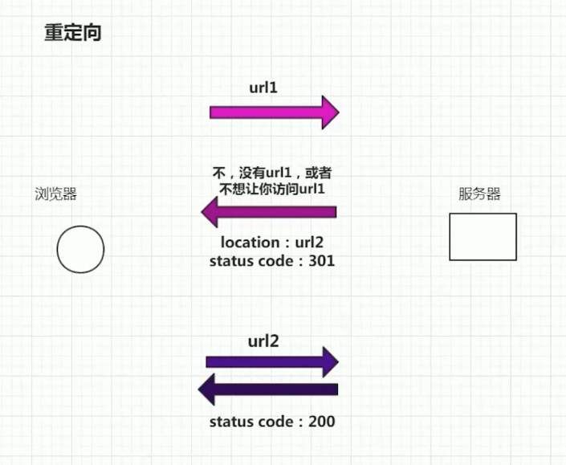

# flaskApp
flask learning


* kill whatever process is using port 8080 so that I can vagrant up?
```
lsof -n -i4TCP:5000
kill -9 PID
```


[2-6 flask最小原型与唯一URL原则.avi]()

URL兼容/原理： 重定向 2-6




2-7 路由的另一种注册方法

```
## 调试状态 无需反复启动服务器
app.run(debug=True)

# 主要用于基于类的视图，即插视图
app.add_url_rule('/hi',view_func=hello)
```


2-8 app.run相关参数与flask配置文件

```
#接受外网访问，端口设置
app.run(host="0.0.0.0", debug=True,port=5000)

## subclass of the dict:  app.config['DEBUG']
## all variable in config should be in capital 
app.config.from_object('config')
app.run(host="0.0.0.0", debug=app.config['DEBUG'] ,port=5000)
```


2-9 你并没有真正理解 if __name__的作用 .

```
Nginx + uwsgi 
```


2-10 响应对象：Response

```
view function return

status code 200, 404, 301
content-type httpheaders
content-type= text/html
Response object


def hello():
    headers ={
        'content-type' : 'text/plain'
    }
    response = make_response('<html></html>',404)
    response.headers =headers
    return response
    
## 301 location url redirection     
def hello():
    headers ={
        'content-type' : 'text/plain',
        'location':'https://kepler.gl/demo'
    }
    response = make_response('<html></html>',301)
    response.headers =headers
    return response
    
def hello():
    headers ={
        'content-type' : 'text/plain',
        'location':'https://kepler.gl/demo'
    }
    # response = make_response('<html></html>',301)
    # response.headers =headers
    ## return a simple tuple as response
    return '<html></html>',301,headers

```


3-1 搜索而不是拍照上传

3-2 数据API

```
关键字搜索
http://t.yushu.im/v2/book/search?q={}&start={}&count={}

isbn搜索
http://t.yushu.im/v2/book/isbn/{isbn}
```

3-3 搜索关键字

```
# get agrv from url
@app.route('/book/search/<q>/<page>')
def search(q,page):
```

3-4 简单的重构

```

```

3-5 requests发送http请求及代码的简化手段

```

```


