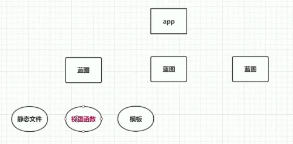

# flaskApp
flask learning


* kill whatever process is using port 8080 so that I can vagrant up?
```
lsof -n -i4TCP:5000
kill -9 PID
```


[2-6 flask最小原型与唯一URL原则.avi]()

URL兼容/原理： 重定向 2-6


2-7 路由的另一种注册方法

```
## 调试状态 无需反复启动服务器
app.run(debug=True)

# 主要用于基于类的视图，即插视图
app.add_url_rule('/hi',view_func=hello)
```


2-8 app.run相关参数与flask配置文件

```
#接受外网访问，端口设置
app.run(host="0.0.0.0", debug=True,port=5000)

## subclass of the dict:  app.config['DEBUG']
## all variable in config should be in capital 
app.config.from_object('config')
app.run(host="0.0.0.0", debug=app.config['DEBUG'] ,port=5000)
```


2-9 你并没有真正理解 if __name__的作用 .

```
Nginx + uwsgi 
```


2-10 响应对象：Response

```
view function return

status code 200, 404, 301
content-type httpheaders
content-type= text/html
Response object


def hello():
    headers ={
        'content-type' : 'text/plain'
    }
    response = make_response('<html></html>',404)
    response.headers =headers
    return response
    
## 301 location url redirection     
def hello():
    headers ={
        'content-type' : 'text/plain',
        'location':'https://kepler.gl/demo'
    }
    response = make_response('<html></html>',301)
    response.headers =headers
    return response
    
def hello():
    headers ={
        'content-type' : 'text/plain',
        'location':'https://kepler.gl/demo'
    }
    # response = make_response('<html></html>',301)
    # response.headers =headers
    ## return a simple tuple as response
    return '<html></html>',301,headers

```


3-1 搜索而不是拍照上传

3-2 数据API

```
关键字搜索
http://t.yushu.im/v2/book/search?q={}&start={}&count={}

isbn搜索
http://t.yushu.im/v2/book/isbn/{isbn}
```

3-3 搜索关键字

```
# get agrv from url
@app.route('/book/search/<q>/<page>')
def search(q,page):
```

3-4 简单的重构

```

```

3-5 requests发送http请求及代码的简化手段

```
class HTTP:

    @staticmethod
    def get(url, return_json=True):
        r = requests.get(url)
        # restful
        # json
        if r.status_code != 200:
            return {} if return_json else ''
        return r.json() if return_json else r.text

```


3-6 requests vs urllib

```
staticmethod vs classmethod
staticmethod: no self
classmethod : no self but cls

经典类 VS 新式类
```

3-7 从API获取数据


```
self : 链式查找


from http import HTTP

class YuShuBook:
    isbn_url ='http://t.yushu.im/v2/book/isbn/{}'
    keyword_url = 'http://t.yushu.im/v2/book/search?q={}&start={}&count={}'

    @classmethod
    def search_by_isbn(cls, isbn):
        url = cls.isbn_url.format(isbn)
        result=HTTP.get(url)
        return result
    @classmethod
    def search_by_keyword(cls, keyword, count=15, start=0):
        url = cls.keyword_url.format(keyword, count, start)
        results = HTTP.get(url)
        return results
```

3-8 使用jsonify

http.py 会与 自带的http.client 冲突


3-9 将视图函数拆分到单独的文件中 

如何导入 app 到分文件中？

3-10 深入了解flask路由


3-11 循环引入流程分析.a


3-12 找不到视图函数的最终解释与证明

```
print ("id:" + str(id(app) + entity)
```


4-1 应用、蓝图与视图函数




4-2 用蓝图注册视图函数

App/init

```
from flask import Flask


def create_app():
    app = Flask(__name__)
    app.config.from_object('config')
    register_blueprint(app)
    return app

def register_blueprint(app):
    from app.web.book import web
    app.register_blueprint(web)
```

app/Web/book

```
from flask import jsonify
from yushun_book import YuShuBook 
from helper import is_isbn_or_key
from flask import Blueprint

web = Blueprint('web',__name__)

@web.route('/book/search/<q>/<page>')
def search(q,page):
    isbn_or_key = is_isbn_or_key(q)
    if isbn_or_key =='isbn':
        result = YuShuBook.search_by_isbn(q)
    else:
        result = YuShuBook.search_by_keyword(q)

    return jsonify(result)
 
```


4-3 单蓝图多模块拆分视图函数


```
__init__.py
from flask import Blueprint

web = Blueprint('web', __name__)

from app.web import book
from app.web import user
```


4-4 request 对象

```
http://localhost:5000/book/search?q=9787111562108&page=123

pyCharm debugger
check the type of request: LocalProxy or response

```

4-5 WTForms参数验证

```
pipenv install wtforms

```

```
from wtforms import Form, StringField, IntegerField
from wtforms.validators import Length, NumberRange


class SearchFrom(Form):
    q = StringField(validators=[Length(min=1, max=30)])
    page = IntegerField(validators=[NumberRange(min=1, max=99)], default=1)

```


4-6 拆分配置文件

```
http://localhost:5000/book/search?q=9787111562108

http://localhost:5000/book/search?q= &page=1

localhost:5000/book/search?q=郭敬明&page=1
```

```
setting.py
secure.py 

from flask import current_app
```


4-7 Model First、Database First与Code First

```
libs
```

4-8 定义第一个模型类

```
pipenv install flask_sqlalchemy
```

```
(flaskApp) jinsanity@jinsanity-pro flaskApp % pipenv graph
Flask-SQLAlchemy==2.4.1
  - Flask [required: >=0.10, installed: 1.1.2]
    - click [required: >=5.1, installed: 7.1.1]
    - itsdangerous [required: >=0.24, installed: 1.1.0]
    - Jinja2 [required: >=2.10.1, installed: 2.11.2]
      - MarkupSafe [required: >=0.23, installed: 1.1.1]
    - Werkzeug [required: >=0.15, installed: 1.0.1]
  - SQLAlchemy [required: >=0.8.0, installed: 1.3.16]
http-client==0.1.22
  - pycurl [required: Any, installed: 7.43.0.5]
  - six [required: Any, installed: 1.14.0]
requests==2.23.0
  - certifi [required: >=2017.4.17, installed: 2020.4.5.1]
  - chardet [required: >=3.0.2,<4, installed: 3.0.4]
  - idna [required: >=2.5,<3, installed: 2.9]
  - urllib3 [required: >=1.21.1,<1.26,!=1.25.1,!=1.25.0, installed: 1.25.9]
WTForms==2.2.1

```

4-9 将模型映射到数据库中

```
from app.models.book import db
    
    db.init(app)
```

```
pipenv install cymysql
```

```
SQLALCHEMY_DATABASE_URI =
```

```
def create_app():
    app = Flask(__name__)
    app.config.from_object('app.secure')
    app.config.from_object('app.setting')
    register_blueprint(app)

    db.init_app(app)
    db.create_all()
    return app
```

```
RuntimeError: No application found. Either work inside a view function or push an application context.
```


4-10 ORM与CodeFirst区别

```
db.create_all(app=app）

## MVC model 业务逻辑放M层
```


